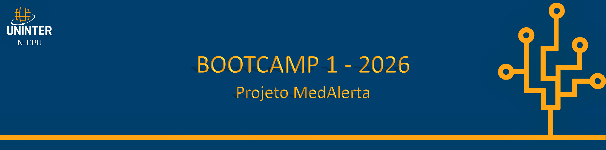

<!-- Área do Banner -->
<div align="center" style="background-color: white; max-width: 100%;">
  
</div>

<!-- Título e descrição -->
<div align="center">
  <h1>MedAlerta</h1>
  <p><b>Projeto base para desenvolvimento de um sistema de gerenciamento de medicamentos, preparado com arquitetura em camadas, containers Docker e boas práticas de engenharia de software.</b></p>
</div>

<!-- Tecnologias -->
<p align="center">
  <a href="https://www.java.com/" title="Java">
    
  </a>
  +
  <a href="https://spring.io/projects/spring-boot" title="Spring Boot">
    
  </a>
  +
  <a href="https://www.mysql.com/" title="MySQL">
    
  </a>
  +
  <a href="https://www.docker.com/" title="Docker">
    
  </a>
  +
  <a href="https://code.visualstudio.com/" title="VSCode">
    
  </a>
</p>

---

# 👥 Professores

| [](https://github.com/N-CPUninter) | [](https://github.com/guipatriota) | [](https://github.com/N-CPUninter) | [](https://github.com/N-CPUninter) | [](https://github.com/N-CPUninter) |
| :----------------------------------------------------------------------------------------------------------------------------------------------------------------------------------------: | :---------------------------------------------------------------------------------------------------------------------------------------------------------: | :----------------------------------------------------------------------------------------------------------------------------------------------------------------------------------------: | :---------------------------------------------------------------------------------------------------------------------------------------------------------: | :----------------------------------------------------------------------------------------------------------------------------------------------------------------------------------------: |
| [Prof. Me. Rodrigo da Silva do Nascimento](https://github.com/N-CPUninter) | [Prof. Guilherme Patriota](https://github.com/guipatriota) | [Prof. Neusa Grando](https://github.com/N-CPUninter) | [Prof. Leonam Cordeiro de Oliveira](https://github.com/N-CPUninter) | [Prof. Eros Leon Kohler](https://github.com/N-CPUninter) |

---

# 📌 Descrição

Este repositório contém a **infraestrutura base e estrutura arquitetural do projeto MedAlerta**, desenvolvida para o Bootcamp de Engenharia de Software.

O objetivo é preparar um ambiente profissional para desenvolvimento, incluindo:

- Arquitetura em camadas
- Containerização da aplicação
- Banco de dados MySQL integrado
- Configuração por variáveis de ambiente
- Inicialização automática do banco
- Base para CI/CD com GitHub Actions

Esta base será utilizada nas aulas seguintes para implementação de:

- CRUD
- Integração com banco de dados
- Regras de negócio
- Autenticação e segurança

---

# 🏗️ Arquitetura

O projeto segue o padrão de **arquitetura em camadas**:

Service → Repository → Banco de Dados

- **Service**: regras de negócio  
- **Repository (CRUD)**: acesso aos dados  
- **Banco (MySQL)**: persistência  

A aplicação poderá ser exposta via API (ex: REST), mas isso não é foco inicial.

---

# 🧱 Infraestrutura Base

O projeto utiliza Docker para padronizar o ambiente.

## Containers

- **app** → ambiente Java (desenvolvimento)
- **db** → MySQL

## Características

- Comunicação entre containers via rede interna
- Banco acessível externamente (Workbench)
- Aplicação acessível via navegador
- Ambiente reproduzível em qualquer máquina

---

# ⚙️ Pré-requisitos

- Docker Desktop
- VSCode
- Extensão Dev Containers (recomendado)

---

# 🚀 Como executar o projeto

## 1. Configurar variáveis de ambiente

```bash
cp .env.example .env
```
## 2. Subir os containers

```bash
docker compose up --build
```

## 3. Acessos

- Aplicação: http://localhost:8080  
- Health (se implementado): http://localhost:8080/actuator/health  
- MySQL: localhost:3306  

---

# 🗄️ Banco de Dados

O banco MySQL é inicializado automaticamente através de scripts em:

docker/mysql/init/

⚠️ Importante:

- Scripts `.sql` são executados apenas na primeira inicialização
- Para reinicializar o banco:

```bash
docker compose down -v  
docker compose up --build  
```
---

# 🧪 GitHub Actions (CI)

O projeto inclui um pipeline de CI que:

- Sobe um MySQL temporário
- Executa testes automatizados
- Gera a imagem Docker de produção

---

# 🔐 Segurança (base)

A estrutura já considera boas práticas iniciais:

- Uso de variáveis de ambiente para credenciais
- Separação entre configuração e código
- Preparação para autenticação
- Proteção contra SQL Injection (uso de ORM nas próximas etapas)

---

# ⚠️ Observações importantes para trabalhos fora deste BOOTCAMP

- Este projeto representa uma **infraestrutura de desenvolvimento**
- Em produção real:
  - o banco não deve rodar em container local
  - credenciais devem ser armazenadas em cofres seguros
  - devem existir mecanismos de backup e redundância

---

# 🎯 Objetivo do Bootcamp

Construir um sistema completo a partir de uma base profissional, abordando:

- Arquitetura de software
- Infraestrutura
- Segurança
- Banco de dados
- Desenvolvimento backend
